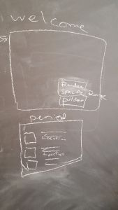
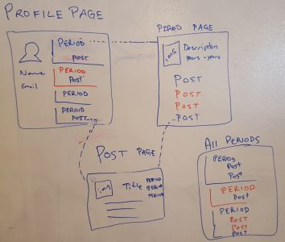
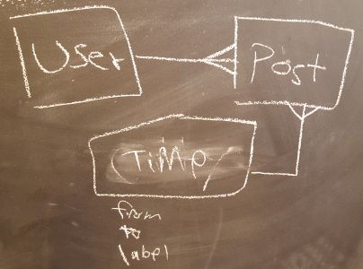
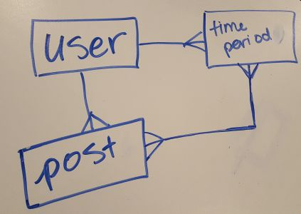

# Time Travelog

## Brief

The world is an interesting place...
And time!  Our app gives the discriminating Time Traveller a place to record the greatest moments through history in various places on Earth.  Ask not where, but when!!

## Project Planning

The client has provided basic wireframes and user stories. In some cases, these requirements may be vague or incomplete.

[User Stories](./user-stories.md)

 

Wireframes

 

 
## Project Tracking
 
 [Trello](https://trello.com/b/ne3nmsgj/time-travel-app)
 
 [Project calendar](https://docs.google.com/spreadsheets/d/1_JsJJkhEbKozaXYS46MyXUc1NyH7Gu0AEqAUm_fgLlE/edit#gid=0)

# Original Task

## Expectations

**IMPORTANT:** You may not begin a new sprint or start on a bonus without client approval.

**pair program**

communicate your current status 
Use **Trello** to organize 
Commit changes at least once for each user story. 
Consider creating **automated tests** or even implementing TDD for any complex application behavior.

**Design**. Use a CSS framework (e.g. Bootstrap), partials, and some custom CSS or Sass/Less.

Use the **[git collaborator scenario](./git-collaboration-workflow.md)</a>, feature branches, and pull requests**.

**Refactor** your code after each sprint, considering:

* Indentation
* Readability
* Naming
* Organization
* Commenting
* DRYness

## Questions to Ask Yourselves

1. **Are you all clear about what the client wants?** 
2. **What will the UX/UI flow be?** 
3. **Which models do you need to implement?** Create an ERD
4. **What are the major milestones or components that you need to complete?** turned into tasks
Where do these milestones overlap and how will those related tasks be managed?
5. **What milestones are you and your group members interested in working on?** 
delegate the work so that each is interested, challenged, and productive?

#### Group \#1 - Annabelle
* Michael N
* Ben
* Vanessa
* Jen

## Presentation

Each group will present their project on **Friday, June 24th** starting at **10:00am** for 10 minutes.

Each member of your group should speak during your presentation and mention which parts of the project they worked on.

**Your presentation should include:**

* Tour (demo) of your app.
* How did your group approach the requirements? (mention anything unique or creative your group chose to do)
* What was easier than you thought? What was more challenging?
* What is a lesson you will carry forward to working on Project 2?
* Shout outs for fellow students!
